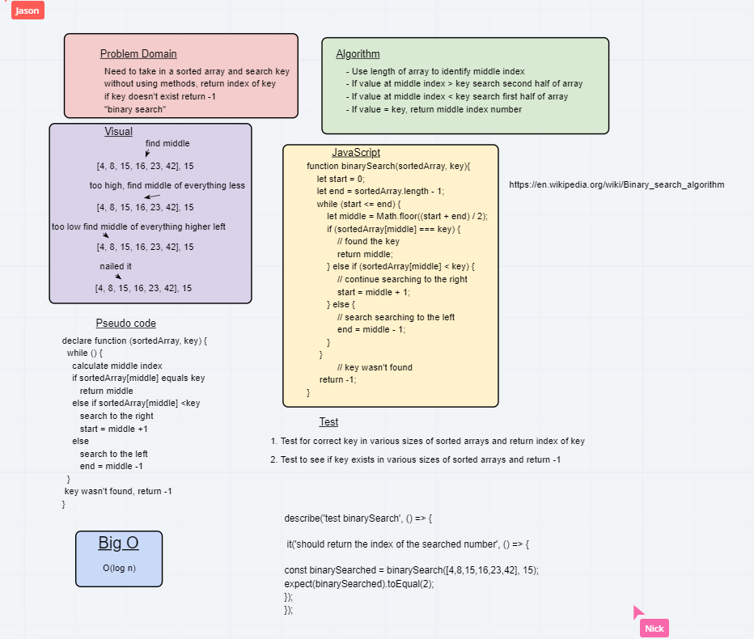

# data-structures-and-algorithms-401
Code challenges for 401

# Reverse an Array
  * find the index of a given key in a sort array

## Challenge 03
 * reverse an array without using an built in method

## Approach & Efficiency
 * O(log n)
 * first get familair with the testing environment 
 * made sure everything was setup properly by consoling logging arr and key
 * write a while loop and divide each search in half until the key is found or not found

 ## Colaborators
  * Carly Dekock
  * Nick Magruder
  * Jason Quaglia

  ## Links

  [https://www.geeksforgeeks.org/binary-search-in-javascript/](https://www.geeksforgeeks.org/binary-search-in-javascript/)
  [https://en.wikipedia.org/wiki/Binary_search_algorithm](https://en.wikipedia.org/wiki/Binary_search_algorithm)
  [https://medium.com/@jeffrey.allen.lewis/javascript-algorithms-explained-binary-search-25064b896470](https://medium.com/@jeffrey.allen.lewis/javascript-algorithms-explained-binary-search-25064b896470)
  [https://cooervo.github.io/Algorithms-DataStructures-BigONotation/index.html](https://cooervo.github.io/Algorithms-DataStructures-BigONotation/index.html)

