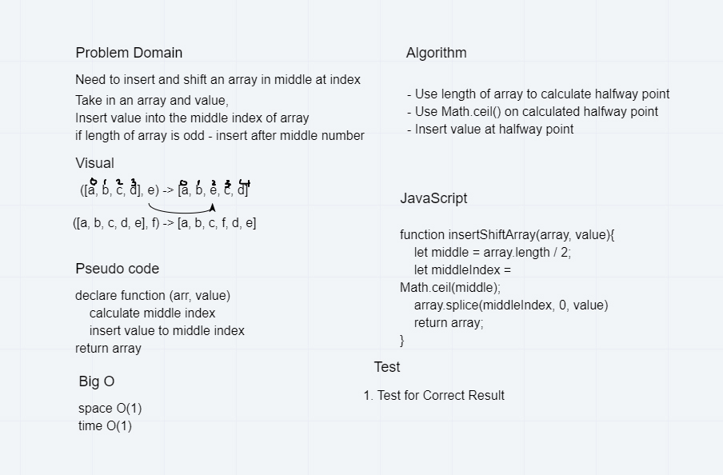

# data-structures-and-algorithms-401
Code challenges for 401

# Reverse an Array
  * insert element into the middle of an array

## Challenge 01
 * reverse an array without using an built in method

## Approach & Efficiency
 * O(N)
 * first get familair with the testing environment 
 * made sure everything was setup properly by consoling logging arr and val
 * white boarded the problem
 * wrote the test cases
 * solved the code challenge

 ## Whiteboard
 
