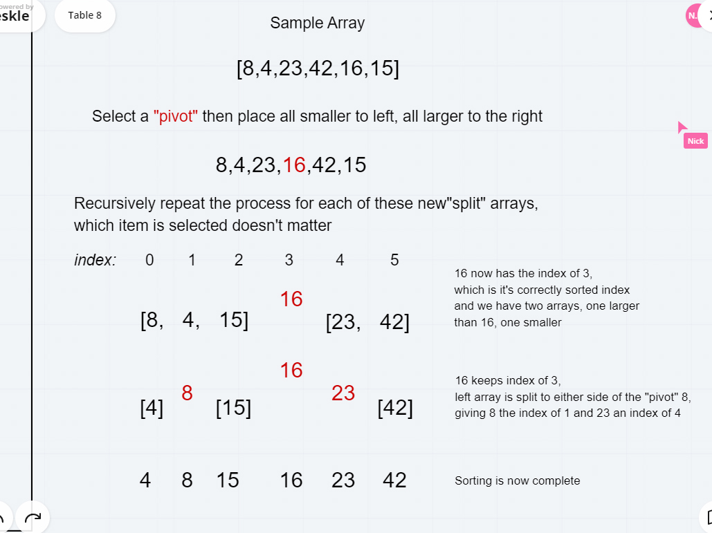

# data-structures-and-algorithms-401
Code challenges for 401

## Challenge 28 quick sort
 * Sort an array with an quick sort

## Approach & Efficiency
 * O(log n)
 * O * log n
 * first get familair with the testing environment 
 * made sure everything was setup properly by consoling logging arr and val
 * white boarded the problem
 * wrote the test cases
 * solved the code challenge

 ## Colaborators
 * Jason Quagila
 * Carly Dekock
 * Nick Magruder
 * Seid

 ## Whiteboard
 